# 🌍 Wanderlust - Travel Application with CI/CD on AWS

<!--  Add your own banner image here -->

## 🚀 Overview
Wanderlust is a modern web-based travel application built using Django, designed to help travel enthusiasts discover, plan, and manage trips efficiently. The application integrates CI/CD pipelines using AWS services for automated deployment, ensuring a smooth and scalable experience for users.

## ✨ Features
| Feature | Description |
|---------|-------------|
| 🔐 **User Authentication** | Secure user registration and login system with password hashing |
| 🗺️ **Trip Management** | Create, modify, and delete trips with ease |
| 🔍 **Trip Discovery** | Search and join trips based on preferences |
| 👥 **Community** | Share experiences and get recommendations |
| ⚙️ **CI/CD Automation** | CodePipeline automates testing and deployment |
| ☁️ **Hosting** | Render (replaced AWS Elastic Beanstalk) |
| 📁 **Static Files** | Local storage (previously used AWS S3) |

## 🛠️ Technologies Used
| Category | Technologies |
|----------|--------------|
| **Backend** | Django (Python) |
| **Frontend** | HTML, CSS, JavaScript |
| **Database** | SQLite3 (local), Amazon RDS MySQL (production) |
| **CI/CD** | AWS CodePipeline, AWS CodeBuild |
| **Deployment** | AWS Elastic Beanstalk |
| **Analysis** | Pylint, SonarCloud |

## 🏗️ Architecture


```mermaid
%%{init: {'theme': 'base', 'themeVariables': { 
    'fontSize': '16px',
    'fontFamily': 'arial',
    'primaryColor': '#009688',
    'primaryTextColor': '#fff',
    'lineColor': '#81C784'
}}}%%

flowchart TD
    A["<strong>Developer</strong>"] -->|"<strong>Git Push</strong>"| B["<strong>GitHub<br>Repository</strong>"]
    B -->|"<strong>Webhook triggers</strong>"| C["<strong>AWS<br>CodePipeline</strong>"]
    C -->|"<strong>Source</strong>"| D["<strong>AWS<br>CodeBuild</strong>"]
    
    D -->|"<strong>Static<br>Analysis</strong>"| E1["<strong>Pylint</strong>"]
    E1 -->|"<strong>Results</strong>"| F{"<strong>Quality<br>Gates</strong>"}
    
    F -->|"<strong>Pass</strong>"| G["<strong>AWS Elastic<br>Beanstalk</strong>"]
    F -->|"<strong>Fail</strong>"| H["<strong>Build<br>Failed</strong>"]
    
    G -->|"<strong>Connect</strong>"| I["<strong>AWS<br>RDS<br>MySQL</strong>"]
    G -->|"<strong>Static<br>Files</strong>"| J["<strong>AWS<br>S3</strong>"]
    G -->|"<strong>Serve</strong>"| K["<strong>Users</strong>"]
    
    %% SonarCloud continuous analysis during runtime
    G -.->|"<strong>Continuous<br>Analysis</strong>"| E2["<strong>SonarCloud</strong>"]
    E2 -.->|"<strong>Monitor</strong>"| G
    
    H -->|"<strong>Notify</strong>"| A
    
    %% Custom styles with improved contrast
    classDef default fill:#2d2d2d,stroke:#666,stroke-width:2px,color:#fff;
    classDef current fill:#1a535c,stroke:#81C784,stroke-width:3px;
    classDef previous fill:#6a1b9a,stroke:#BA68C8,stroke-width:3px;
    classDef continuous fill:#424242,stroke:#81C784,stroke-width:2px,stroke-dasharray: 5 5;
    classDef decision fill:#1565c0,stroke:#90CAF9,stroke-width:3px;
    classDef failure fill:#c62828,stroke:#EF9A9A,stroke-width:3px;
    
    class B,C,D,I,J current;
    class E1 previous;
    class E2 continuous;
    class F decision;
    class H failure;
```

## 🚀 Deployment Process
1. **Code Push**: Developer pushes code to GitHub
2. **Pipeline Trigger**: AWS CodePipeline detects changes
3. **Build & Test**: CodeBuild runs tests and analysis
4. **Deploy**: Successful builds deployed to AWS Elastic Beanstalk

## 🛠️ Getting Started

### 📋 Prerequisites
- Python 3.x
- Django
- AWS Account
- GitHub repository

### ⚙️ Installation
```bash
# Clone the repository
git clone https://github.com/N2B6/deploydevops.git
cd wanderlust

# Create virtual environment
python -m venv venv
source venv/bin/activate  # On Windows use `venv\Scripts\activate`

# Install dependencies
pip install -r requirements.txt

# Apply migrations
python manage.py migrate

# Start development server
python manage.py runserver
```

### 🧪 Running Tests
```bash
python manage.py test
```

## 🔗 Live Deployment
<div align="left">
  <a href="https://deploydevops.onrender.com/" style="background-color: #4CAF50; color: white; padding: 15px 30px; text-decoration: none; border-radius: 8px; font-weight: bold; box-shadow: 0 4px 6px rgba(0, 0, 0, 0.1); transition: all 0.3s ease; display: inline-block; margin: 20px 0;">
    🎯 Live Deployment 🚀
  </a>
</div>

## 📊 Database Configuration
| Environment | Database |
|-------------|----------|
| Development | SQLite3 |
| Production | Amazon RDS MySQL |

## 📁 Static Files
| Environment | Storage |
|-------------|---------|
| Development | Local |
| Production | AWS S3 |

## 📞 Contact
**Author:** Nipun Bakshi  
📧 **Email:** [nipun.bakshi262001@gmail.com](mailto:nipun.bakshi262001@gmail.com)  
💼 **LinkedIn:** [https://www.linkedin.com/in/nipunbakshi/](https://www.linkedin.com/in/nipunbakshi/)

## 📜 License
This project is licensed under the MIT License - see the [LICENSE](LICENSE) file for details.

