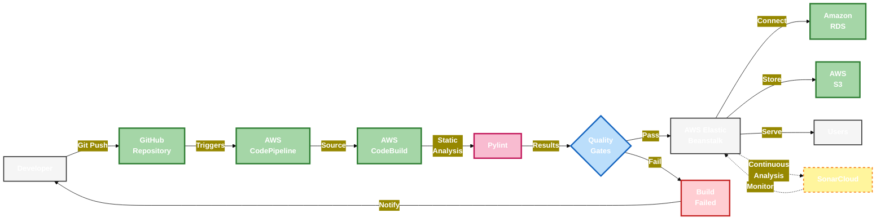

# Wanderlust - Travel Application with CI/CD on AWS

## Overview
Wanderlust is a web-based travel application built using Django, designed to help travel enthusiasts discover, plan, and manage trips efficiently. The application integrates CI/CD pipelines using AWS services for automated deployment, ensuring a smooth and scalable experience for users.

## Features
- **User Authentication**: Secure user registration and login system with password hashing.
- **Trip Creation & Management**: Users can create, modify, and delete trips.
- **Trip Discovery**: Search for and join trips based on preferences and interests.
- **Community & Reviews**: Share travel experiences and get recommendations from other travelers.
- **CI/CD Automation**: CodePipeline automates testing, building, and deployment.
- **Hosting**: Render (replaced AWS Elastic Beanstalk)
- **Static Files**: Local storage (previously used AWS S3)

## Technologies Used
- **Backend**: Django (Python)
- **Frontend**: HTML, CSS, JavaScript
- **Database**: SQLite3 (for local development), Amazon RDS MySQL (for production on AWS)
- **CI/CD**: AWS CodePipeline, AWS CodeBuild
- **Deployment**: AWS Elastic Beanstalk
- **Static Code Analysis**: Pylint, SonarCloud

## Architecture
The application follows a robust architecture where:
1. Users interact via the frontend.
2. Requests are processed by the Django backend.
3. Data is stored and retrieved from the database.
4. CI/CD pipeline automates builds, tests, and deployments.



## Deployment Process
1. Code is pushed to GitHub.
2. AWS CodePipeline detects the changes and triggers the build process.
3. CodeBuild runs tests and static analysis.
4. Successfully built artifacts are deployed to AWS Elastic Beanstalk.

## Getting Started
### Prerequisites
- Python 3.x
- Django
- AWS Account (for deployment)
- GitHub repository

### Installation
1. Clone the repository:
   ```bash
   git clone https://github.com/N2B6/deploydevops.git
   cd wanderlust
   ```
2. Create a virtual environment and install dependencies:
   ```bash
   python -m venv venv
   source venv/bin/activate  # On Windows use `venv\Scripts\activate`
   pip install -r requirements.txt
   ```
3. Apply migrations:
   ```bash
   python manage.py migrate
   ```
4. Start the development server:
   ```bash
   python manage.py runserver
   ```

### Running Tests
Use the following command to run tests:
```bash
python manage.py test
```

## CI/CD Pipeline
### Steps in the Pipeline
1. **Source Stage**: Detects changes in GitHub repository.
2. **Build Stage**: AWS CodeBuild runs tests, linting (Pylint), and code analysis (SonarCloud).
3. **Deploy Stage**: Successful builds are deployed to AWS Elastic Beanstalk using CodeDeploy.

### Static Code Analysis
The CI/CD pipeline includes automated static analysis with Pylint:
- Ensures code quality
- Detects missing docstrings, long lines, unused imports, etc.

## Deployment URL
The application is deployed at:
[https://deploydevops.onrender.com/](https://deploydevops.onrender.com/)

## Database Configuration
The application uses different databases for development and production:
- **Development**: SQLite3 (default Django configuration)
- **Production**: Amazon RDS MySQL (configured via environment variables in Elastic Beanstalk)

This dual configuration allows for:
- Free/local development testing
- Scalable, managed database service in production
- Automatic switching based on Django's environment settings

## Static Files Configuration
The application handles static files differently between environments:
- **Development**: Served locally using Django's built-in server
- **Production**: Collected and served from local storage on Render
  - Uses Django's `collectstatic` during deployment
  - Configured via `STATIC_ROOT` and `STATIC_URL` settings
- **Previous Setup**: AWS S3 was used for static file storage (now changed to local storage as my aws free tier is over)

## Contact
**Author:** Nipun Bakshi  
**Email:** nipun.bakshi262001@gmail.com
**LinkedIn:** [https://www.linkedin.com/in/nipunbakshi/]

## License
This project is licensed under the MIT License - see the [LICENSE](LICENSE) file for details.

